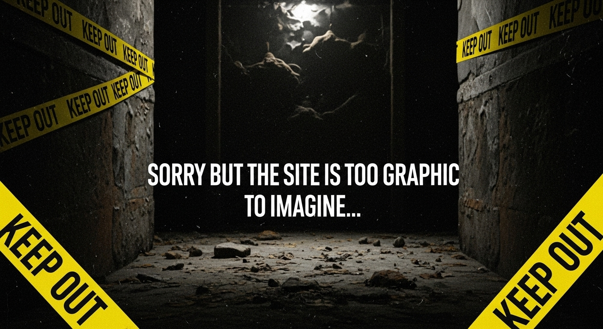

# Timeline Twist v2.0



> "What if history took a different turn? Explore alternate realities with AI-powered storytelling."

**Timeline Twist v2.0** is an innovative web application that lets you rewrite history! Select a pivotal historical event, propose an alternate outcome, and watch as AI generates a dramatic, year-by-year timeline of consequences. Each event comes alive with AI-generated imagery, detailed drill-down views, and theatrical commentary from an AI narrator.

## ✨ Features

- **Alternate History Simulation**: Choose from predefined events or create your own "what if" scenarios
- **AI-Powered Timelines**: Gemini 2.5 Flash generates compelling, dramatic narratives
- **Visual Storytelling**: Imagen AI creates evocative images for each historical event
- **Interactive Drill-Down**: Click on any event for detailed analysis and deeper insights
- **Theatrical Commentary**: AI commentator narrates the timeline with dramatic flair
- **Text-to-Speech**: Listen to the commentary with built-in speech synthesis
- **Responsive Design**: Works seamlessly on desktop and mobile devices
- **Matrix-Themed UI**: Cyberpunk aesthetic with animated backgrounds

## 🛠️ Tech Stack

### Frontend
- **React 19** - Modern UI framework with hooks and concurrent features
- **TypeScript** - Type-safe JavaScript for robust development
- **Vite** - Lightning-fast build tool and dev server

### AI & APIs
- **Google Gemini 2.5 Flash** - Advanced language model for timeline generation
- **Google Imagen 3.0** - AI image generation for historical events
- **Web Speech API** - Browser-native text-to-speech synthesis

### Development
- **Node.js** - Runtime environment
- **npm** - Package management

## 📋 Prerequisites

Before running this application, make sure you have:

- **Node.js** (version 18 or higher) - [Download here](https://nodejs.org/)
- **Git** - For cloning the repository
- **Google Gemini API Key** - Get yours from [Google AI Studio](https://makersuite.google.com/app/apikey)

## 🚀 Installation & Setup

1. **Clone the repository**
   ```bash
   git clone https://github.com/sobiswriter/TimeLine-Twist-V2.git
   cd TimeLine-Twist-V2
   ```

2. **Install dependencies**
   ```bash
   npm install
   ```

3. **Set up environment variables**
   - Copy the `.env.local` file (if it doesn't exist, create it)
   - Add your Gemini API key:
     ```
     GEMINI_API_KEY=your_api_key_here
     ```

4. **Start the development server**
   ```bash
   npm run dev
   ```

5. **Open your browser**
   - Navigate to `http://localhost:5173` (or the port shown in terminal)
   - Start exploring alternate histories!

## 📖 Usage

1. **Select an Event**: Choose from predefined historical events or create a custom scenario
2. **Propose a Change**: Describe how you'd alter the course of history
3. **Generate Timeline**: Watch as AI creates a branching timeline of consequences
4. **Explore Details**: Click on any event for AI-generated images and deeper analysis
5. **Listen to Commentary**: Use the speaker icon to hear dramatic narration
6. **Chat with AI**: Ask the AI assistant questions about the timeline

## 🏗️ Build & Deploy

### Build for Production
```bash
npm run build
```

### Preview Production Build
```bash
npm run preview
```

The built files will be in the `dist/` directory, ready for deployment to any static hosting service like Vercel, Netlify, or GitHub Pages.

## 🤝 Contributing

We welcome contributions! Here's how you can help:

1. Fork the repository
2. Create a feature branch (`git checkout -b feature/amazing-feature`)
3. Commit your changes (`git commit -m 'Add amazing feature'`)
4. Push to the branch (`git push origin feature/amazing-feature`)
5. Open a Pull Request

## 📄 License

This project is open source and available under the [MIT License](LICENSE).

## 🙏 Acknowledgments

- **Google AI** for the powerful Gemini and Imagen models
- **React Team** for the amazing framework
- **Vite Team** for the blazing-fast build tool
- Historical events inspired by real scholarship and speculative fiction

---

**Made with ❤️ and a dash of alternate history madness**

*What twist will you give to history today?*
